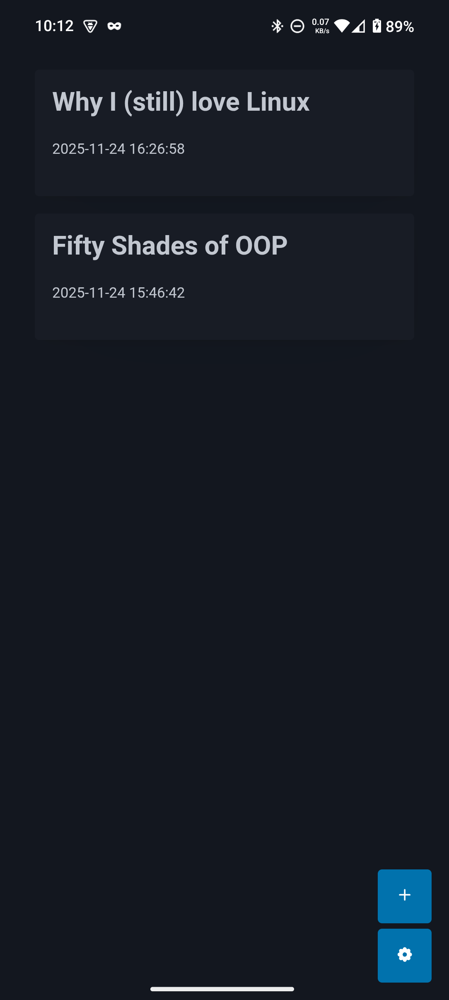
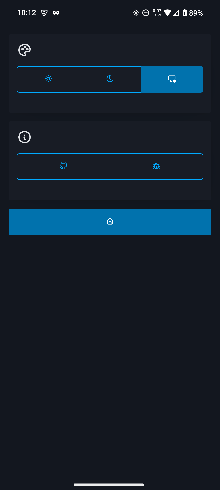
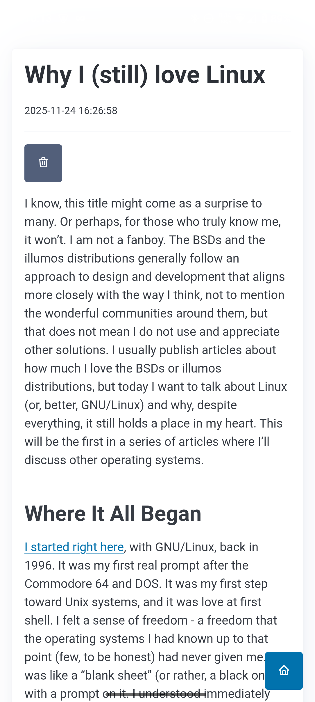
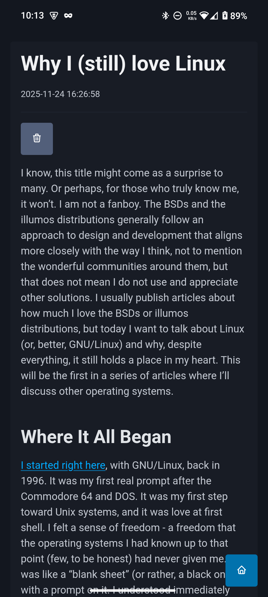

# Read It Later

Read it later app done using Tauri. Mainly for android.

## Setup

```bash
cargo install trunk tauri-cli
cargo install wasm-bindgen-cli
```

## Development

```bash
cargo tauri dev
```

## Build

```bash
cargo tauri build
```

## Android

Setup environment as per [tauri](https://v2.tauri.app/start/prerequisites/#android).

- `JAVA_HOME`: can point to jbr folder from android studio.
- `ANDROID_HOME`: Possibly in `~/Android/Sdk`.
- `NDK_HOME`: Extracted NDK package folder. (e.g.: `android-ndk-r27d`)

To develop use (needs to be in same network):

```bash
cargo tauri android dev
```

To build use:

Follow code signing as per [here](https://tauri.app/distribute/sign/android/).

```bash
cargo tauri android build
```

## Screenshots

|||
|---|---|
|||

## Roadmap

- Feature: Import and Export of URLs.
- Chore: Move model to command place to access by Tauri and Yew.

## Acknowledgment

- [Pico Css](https://picocss.com/)
- [Tabler icons](https://tabler.io/icons)
- [Readability Library](https://github.com/theiskaa/readabilityrs)

## Works well with

- [SherpaTTS](f-droid.org/packages/org.woheller69.ttsengine/)
