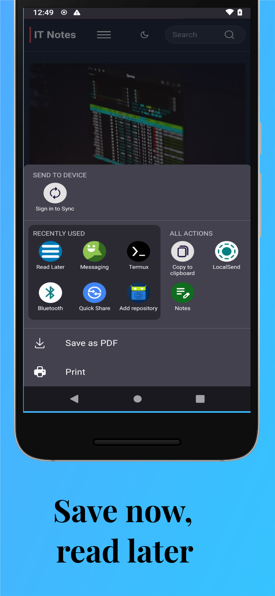
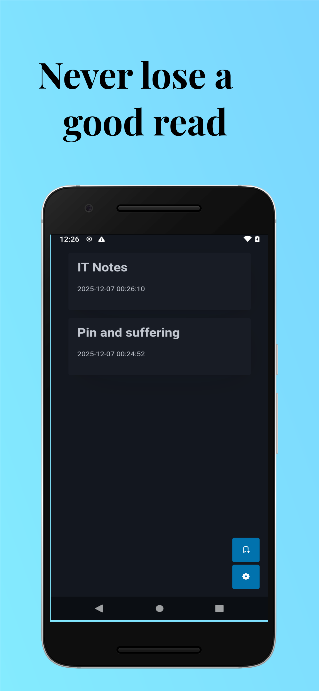
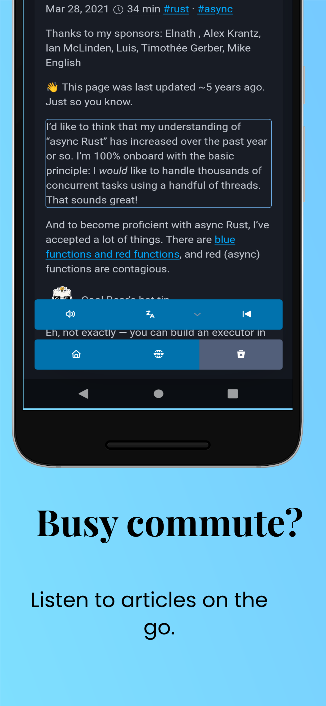
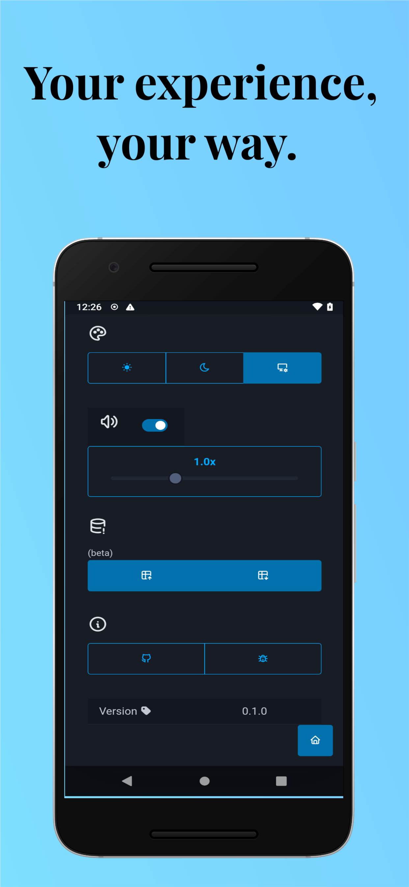
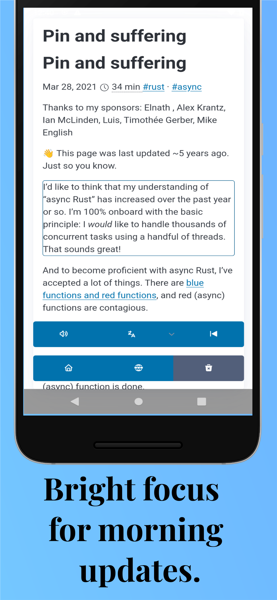
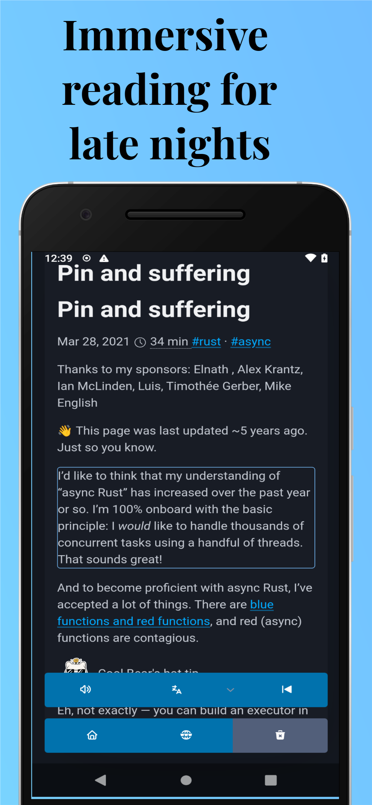

# Read It Later

Read it later app done using Tauri. Mainly for android.


## Install

[](https://apt.izzysoft.de/packages/io.github.sak.read.it.later)

<!--
[](https://play.google.com/store/apps/details?id=io.github.sak.read.it.later)
-->

[](https://github.com/sak96/read_later/releases/latest)

## Setup

```bash
npm install --package-lock
cargo install tauri-cli@2.9.5
```

## Development

```bash
cargo tauri dev
```

## Build

```bash
cargo tauri build
```

## Android

Setup environment as per [tauri](https://v2.tauri.app/start/prerequisites/#android).

- `JAVA_HOME`: can point to jbr folder from android studio.
- `ANDROID_HOME`: Possibly in `~/Android/Sdk`.
- `NDK_HOME`: Extracted NDK package folder. (e.g.: `android-ndk-r27d`)

To develop use (needs to be in same network):

```bash
cargo tauri android dev
```

To build use:

Follow code signing as per [here](https://tauri.app/distribute/sign/android/).

```bash
cargo tauri android build  --split-per-abi
```

## Screenshots

|||
|---|---|
|||
|||

## Roadmap

- image handling during offline.
- keep awake during tts.
- create [issue](https://github.com/sak96/read_later/issues) for more features

## License

[](https://opensource.org/licenses/MIT)

Distributed under the MIT License. See `LICENSE.md` for more information.

## Acknowledgment

- [Pico Css](https://picocss.com/)
- [Lucide icons](https://lucide.dev/icons/)
- [Readability Library](https://github.com/theiskaa/readabilityrs)

## Works well with

- [SherpaTTS](https://f-droid.org/packages/org.woheller69.ttsengine/)
